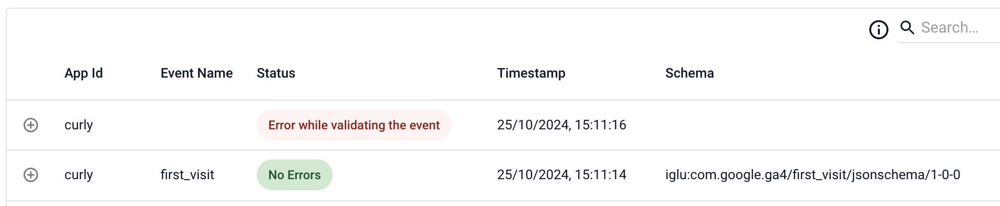
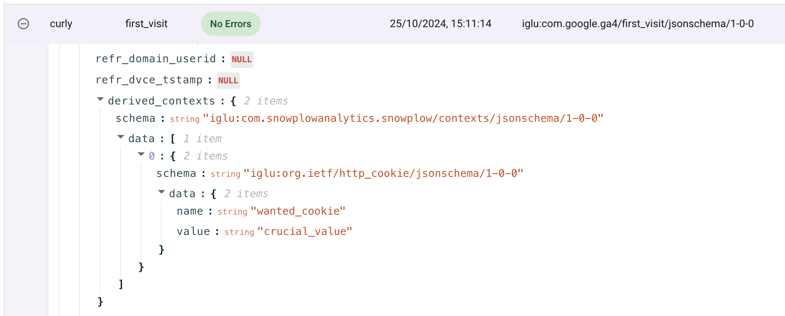
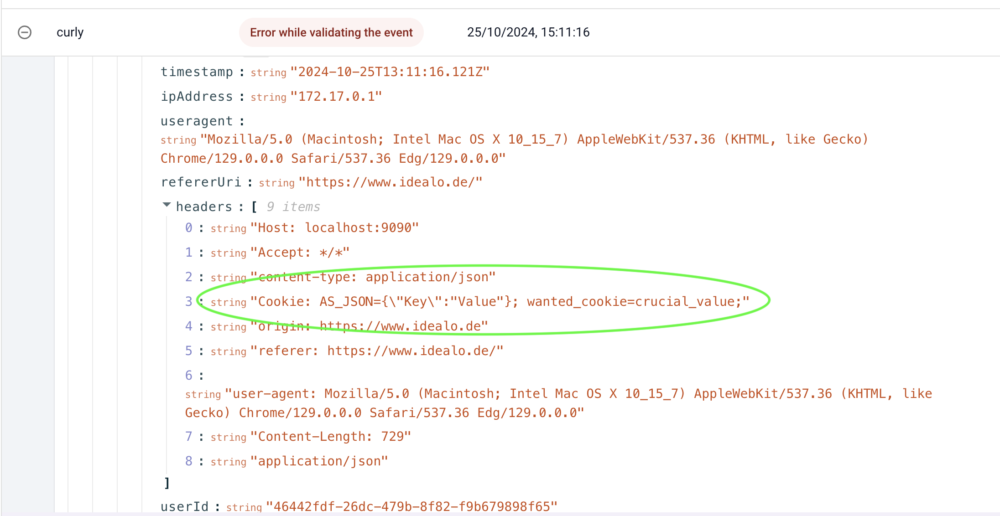

# Snowplow Cookie Extractor Bug Reproduction

## Purpose

Playground repo to demonstrate that a cookie containing a stringified JSON will stop the cookie extractor enrichment, if the required cookie is placed after the stringified JSON

## Expected Behaviour

- Given the cookies `AS_JSON={\"Key\":"Value"}; wanted_cookie=crucial_value;`
- When `wanted_cookie` is configured in the cookie extractor enrichment
- Then the wanted cookie is available in derived_contexts

## Actual Behaviour

The extraction only works if there's no stringified JSON in front of the wanted cookie:

- works: `Cookie: wanted_cookie=crucial_value; AS_JSON={\"Key\":"Value"};`
- breaks: `Cookie: AS_JSON={\"Key\":"Value"}; wanted_cookie=crucial_value;`

# How to reproduce

This repo uses [Snowplow Micro](https://docs.snowplow.io/docs/testing-debugging/snowplow-micro/what-is-micro/) with the cookie extractor configured, and a [custom javascript enrichment](https://docs.snowplow.io/docs/enriching-your-data/available-enrichments/custom-javascript-enrichment/testing/) to easiluy distinguish between good and bad events.

## Usage

1. make sure you have Docker running
2. run `sh 01_setup_micro.sh` in your terminal
3. open localhost:9090 in your browser
4. run `sh 02_send_events.sh` in another terminal

You will see one good and one bad event:

The good event will yield the wanted cookie:

While the bad event gets rejected by the custom enrichment, even though the cookie contains all values:

